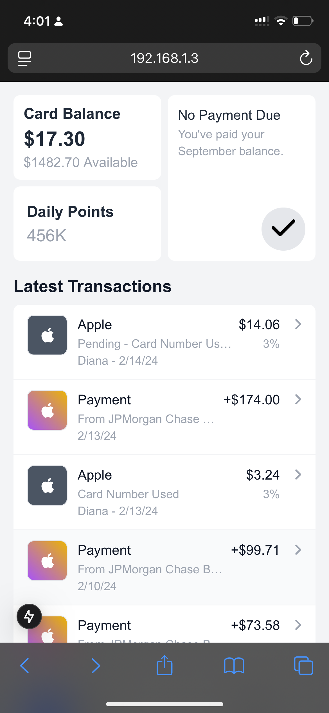
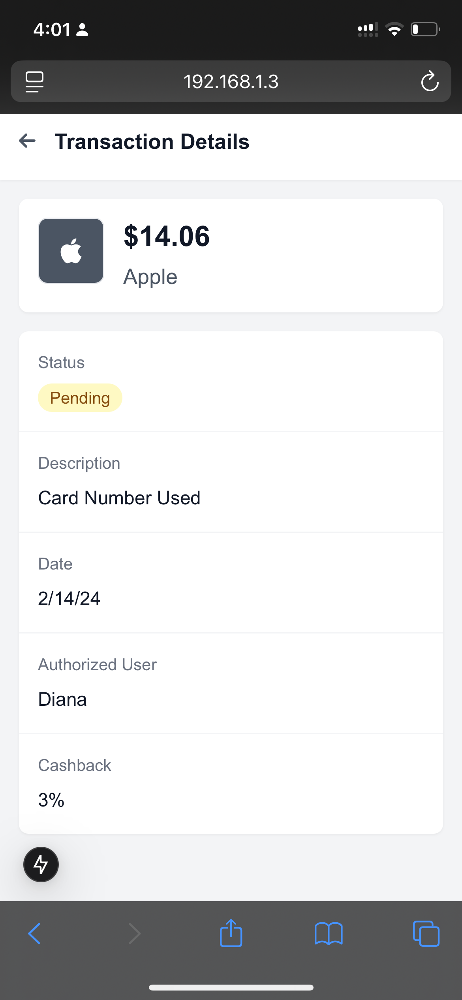

# Wallet App

A modern, mobile-first wallet application built with Next.js and TypeScript. This app allows users to view their card balance, daily points, and transaction history with a clean and intuitive interface.

## Features

- 💳 Card Balance Overview

  - Current balance display
  - Available credit calculation
  - Maximum card limit tracking

- 🏆 Daily Points System

  - Dynamic points calculation based on season
  - Automatic point formatting (K format for large numbers)
  - Daily points accumulation

- 💰 Transaction Management

  - Detailed transaction history
  - Support for pending transactions
  - Authorized user tracking
  - Cashback percentage display
  - Smart date formatting (relative dates for recent transactions)

- 🎨 Modern UI/UX
  - Mobile-optimized layout
  - Clean and intuitive interface
  - Smooth transitions and interactions
  - Consistent design language

## Screenshots

### Main Screen


_Shows the card balance, payment status, daily points, and transaction list_

### Transaction Detail


_Displays detailed information about a specific transaction_

## Technology Stack

- **Framework**: Next.js 14 with App Router
- **Language**: TypeScript
- **Styling**: Tailwind CSS
- **Icons**: FontAwesome
- **State Management**: React Hooks
- **Data Storage**: Local JSON

## Project Structure

```
src/
├── app/                    # Next.js app router pages
├── components/            # React components
│   ├── CardBalance.tsx
│   ├── DailyPoints.tsx
│   ├── NoPaymentDue.tsx
│   ├── TransactionDetail.tsx
│   ├── TransactionItem.tsx
│   └── TransactionList.tsx
├── data/                  # Mock data
│   └── transactions.json
├── types/                 # TypeScript type definitions
│   └── index.ts
└── utils/                 # Utility functions
    └── index.ts
```

## Getting Started

1. Clone the repository
2. Install dependencies:
   ```bash
   npm install
   ```
3. Run the development server:
   ```bash
   npm run dev
   ```
4. Open [http://localhost:3000](http://localhost:3000) in your browser

## Features in Detail

### Card Balance

- Displays current balance
- Shows available credit
- Maximum card limit of $1,500

### Daily Points

- Points calculation based on season
- First day of season: 2 points
- Second day of season: 3 points
- Subsequent days: 100% of points from two days ago + 60% of points from previous day
- Automatic K formatting for points over 1,000

### Transactions

- Type: Credit (expenses) or Payment (top-ups)
- Status: Pending or Completed
- Date formatting:
  - Within last week: Day name
  - Yesterday: "Yesterday"
  - Older: MM/DD/YY
- Support for authorized users
- Cashback percentage display
- Merchant icons with dynamic styling
